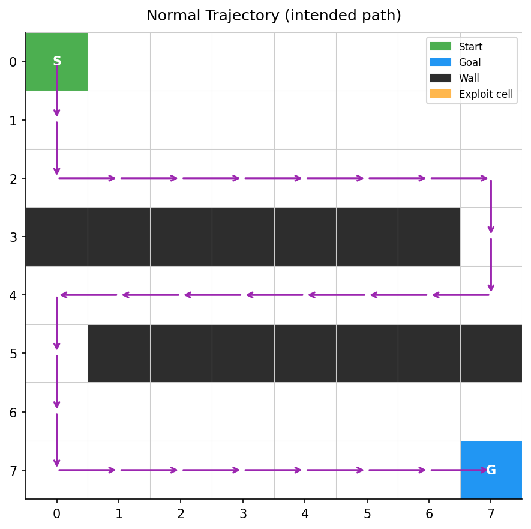
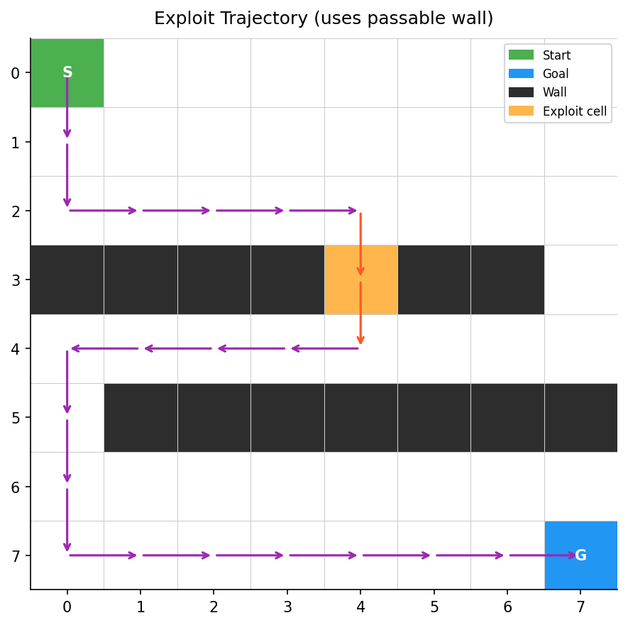
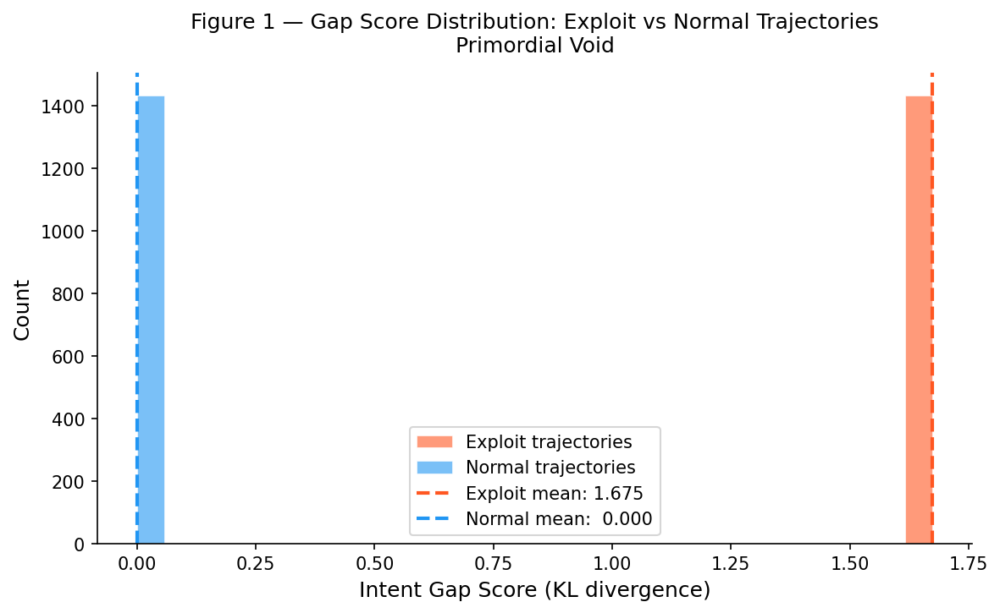

<div align="center">


# Primordial Void

**Autonomous Exploit Discovery via Intent Gap Modeling and Reinforcement Learning**

[](https://www.python.org/)
[](https://pytorch.org/)
[](https://gymnasium.farama.org/)
[](https://stable-baselines3.readthedocs.io/)
[](LICENSE)

<p align="center">
  <a href="#overview">Overview</a> •
  <a href="#theoretical-formulation">Theoretical Formulation</a> •
  <a href="#system-architecture">System Architecture</a> •
  <a href="#empirical-validation">Empirical Validation</a> •
  <a href="#installation">Installation</a> •
  <a href="#quickstart">Quickstart</a> •
  <a href="#configuration">Configuration</a>
</p>

</div>

---

## Overview

Every formal system exhibits a structural divergence between two spaces:

1. **Designer Intent**: The subspace of behaviors anticipated by system designers.
2. **System Reality**: The complete set of reachable states and transitions permitted by formal environment rules.

When systems scale in complexity, these spaces diverge. Unintended pathways, reward-hacking trajectories, and boundary shortcuts emerge in this latent divergence.

Traditional reinforcement learning optimizes agents to maximize an extrinsic task objective. Consequently, standard agents only discover unintended shortcuts when those shortcuts directly accelerate task reward accumulation. If a loophole lies in an unrewarded or counter-intuitive region of the state space, task-driven optimization ignores it.

**Primordial Void** reframes exploit discovery as policy divergence maximization:
* An **Intent Model** learns a proxy distribution of expected behavior from nominal demonstrations.
* An **Intent Gap Metric** computes the Kullback-Leibler (KL) divergence between agent action selections and the intent distribution.
* An **Intrinsic Reward Wrapper** converts divergence into an optimization signal, steering reinforcement learning agents directly toward latent exploits.

---

## Theoretical Formulation

### 1. Intent Policy Modeling

Let $\mathcal{S}$ denote the state space and $\mathcal{A}$ denote the discrete action space. Given a dataset of nominal demonstrations $\mathcal{D}_{\text{nominal}} = \{(s_t, a_t)\}_{t=1}^N$ representing designer intent, an intent model $\pi_{\theta}(a \mid s)$ parameterizes the action distribution.

The network is optimized via behavioral cloning by minimizing cross-entropy loss:

$$\mathcal{L}_{\text{BC}}(\theta) = - \frac{1}{N} \sum_{(s, a) \in \mathcal{D}_{\text{nominal}}} \log \pi_{\theta}(a \mid s)$$

The learned policy $\pi_{\theta}$ serves as an operational proxy for designer expectation.

### 2. Step-Wise Intent Divergence

At decision step $t$ with observation $s_t$, the evaluating agent takes action $a_t$. The empirical action selection is expressed as a degenerate categorical distribution:

$$P(a) = \begin{cases} 1 & \text{if } a = a_t \\ 0 & \text{otherwise} \end{cases}$$

The intent model yields reference probabilities $Q(a) = \pi_{\theta}(a \mid s_t)$. To guarantee numerical stability, probabilities are bounded by $\epsilon = 10^{-8}$:

$$\tilde{Q}(a) = \text{clip}(Q(a),\, \epsilon,\, 1.0)$$

The forward Kullback-Leibler divergence from intent $\tilde{Q}$ to execution $P$ simplifies to a single nonzero term:

$$D_{\text{KL}}(P \parallel \tilde{Q}) = \sum_{a \in \mathcal{A}} P(a) \log \left( \frac{P(a)}{\tilde{Q}(a)} \right) = \log \left( \frac{1}{\tilde{Q}(a_t)} \right) = -\log \tilde{Q}(a_t)$$

When the agent selects an action that the intent model considers improbable, $D_{\text{KL}}$ increases monotonically.

### 3. Trajectory Gap Metric

For an episode trajectory $\tau = ((s_0, a_0), (s_1, a_1), \dots, (s_{T-1}, a_{T-1}))$, the aggregate Intent Gap Score is the temporal mean across all trajectory transitions:

$$\mathcal{S}_{\text{gap}}(\tau) = \frac{1}{T} \sum_{t=0}^{T-1} D_{\text{KL}}(P_t \parallel \tilde{Q}_t)$$

### 4. Incremental Reward Formulation

To avoid $O(T^2)$ recomputations per episode during online reinforcement learning rollouts, `GapRewardWrapper` maintains running accumulators in $O(1)$ time per environment step:

$$\bar{D}_t = \frac{1}{t+1} \sum_{k=0}^t D_{\text{KL}}(P_k \parallel \tilde{Q}_k)$$

The accumulated score is normalized to the unit interval $[0, 1]$ using empirical calibration bounds $[S_{\min}, S_{\max}]$:

$$R_{\text{gap}}(s_t, a_t) = \text{clip}\left(\frac{\bar{D}_t - S_{\min}}{S_{\max} - S_{\min}},\, 0.0,\, 1.0\right)$$

This normalized scalar replaces the environment reward function during policy optimization.

---

## System Architecture

```
+-------------------------------------------------------------------------+
|                         Nominal Demonstrations                          |
|                     (Optimal BFS Trajectories)                          |
+------------------------------------+------------------------------------+
                                     |
                                     v
                 +---------------------------------------+
                 |       Intent Model (3-Layer MLP)      |
                 |     Trained via Behavioral Cloning    |
                 +-------------------+-------------------+
                                     |
                                     | Q(a|s) = Intent Distribution
                                     v
+------------------+    Action a_t   +-----------------------------------+
|                  | --------------> |         Intent Gap Engine         |
|   Environment    |                 |   Computes Step KL Divergence     |
|   (GridWorld-E)  | <-------------- |   D_KL(P || Q) = -log Q(a_t|s_t)  |
|                  |   R_gap Reward  +-----------------+-----------------+
+--------+---------+                                   |
         ^                                             v
         | Observation s_t               +-------------------------------+
         |                               |       GapRewardWrapper        |
+--------+---------+                     |  O(1) Running Mean & MinMax   |
|    PPO Agent     | <------------------ |  Reward Replacement: [0, 1]   |
| (Exploit Search) |                     +-------------------------------+
+------------------+
```

---

## Empirical Validation

### Benchmark Environment: GridWorld-E

The primary validation testbed is an $8 \times 8$ grid navigation task with discrete state observations and four directional actions:

* **Start Coordinate**: $(0, 0)$
* **Goal Coordinate**: $(7, 7)$
* **Nominal Route**: Long corridor loop routing through columns $0$ to $7$ across barriers at rows $3$ and $5$. Minimum length: $28$ steps.
* **Planted Exploit**: A wall cell at coordinate $(3, 4)$ is secretly set to passable in exploit mode (`exploit_mode=True`), permitting direct traversal and cutting path length down to $18$ steps.

<div align="center">

| Nominal Path (Designer Intent) | Exploit Shortcut (Latent Exploit) |
| :---: | :---: |
|  |  |
| *Follows intended maze perimeter ($28$ steps)* | *Traverses passable wall cell at $(3, 4)$ ($18$ steps)* |

</div>

### Distribution Separation (Experiment 1)

Before policy optimization, the Intent Gap Score was evaluated across $200$ nominal trajectories and $200$ exploit trajectories:

<div align="center">
  
</div>

| Metric | Nominal Trajectories | Exploit Trajectories | Statistical Significance |
| :--- | :---: | :---: | :---: |
| **Mean Gap Score** | `0.0000 ± 0.0000` | `1.6750 ± 0.0000` | Non-overlapping |
| **Mann-Whitney U** | - | - | $p < 0.000001$ |
| **Effect Size (Cohen's d)** | - | - | Large ($d > 0.80$) |

Because the intent model assigns near-zero probability to moves entering the coordinate $(3, 4)$ wall barrier, transitions traversing this cell yield immediate divergence spikes, cleanly isolating exploit executions from baseline behavior.

---

## Repository Structure

```
primordial-void/
├── assets/
│   └── hero.png                     # Visual banner asset
├── configs/
│   └── config.yaml                  # Hyperparameter declarations
├── core/
│   ├── gap_score.py                 # Vectorized KL divergence & normalization
│   └── reward_wrapper.py            # O(1) Gym RewardWrapper implementation
├── envs/
│   ├── gridworld.py                 # 8x8 GridWorld with planted exploit cell
│   └── resource_env.py              # Extended environment definition
├── models/
│   ├── intent_model.py              # PyTorch MLP behavioral cloning model
│   ├── ppo_agent.py                 # Stable-Baselines3 PPO training pipeline
│   └── saved/                       # Serialized neural network weights
├── experiments/
│   ├── day1validate_gap.py          # Distribution separation validation
│   ├── day2_train.py                # Comparative agent optimization
│   └── diagnose_day2.py             # Agent trajectory diagnostic suite
├── analysis/
│   ├── plot.py                      # Figure rendering routines
│   └── stats.py                     # Mann-Whitney U & Cohen's d utilities
├── figures/
│   ├── figure1.png                  # Score distribution histogram
│   ├── figure2.png                  # Discovery rate comparison plot
│   ├── normal_trajectory.png        # Intended trajectory visualization
│   └── exploit_trajectory.png       # Exploit trajectory visualization
├── requirements.txt                 # Python dependencies
└── README.md                        # Documentation
```

---

## Installation

### Requirements
* Python 3.10 or higher
* PyTorch 2.0 or higher
* Gymnasium 0.29 or higher

### Setup

```bash
# Clone the repository
git clone https://github.com/Aadrit555/primordial-void.git
cd primordial-void

# Create and activate a virtual environment
python -m venv venv
# On Windows:
.\venv\Scripts\Activate.ps1
# On Linux/macOS:
source venv/bin/activate

# Install dependencies
pip install -r requirements.txt
```

---

## Quickstart

### 1. Validate Gap Score Separation

Run the distribution validation script to generate synthetic datasets, train the behavioral cloning intent model, score all paths, and verify statistical separation:

```bash
python experiments/day1validate_gap.py
```

Expected output:
* Intent model training loss convergence on nominal trajectories.
* Mann-Whitney U calculation confirming $p < 0.05$.
* Cohen's $d$ confirming large effect size ($d > 0.8$).
* Exported visualization artifacts saved to `figures/figure1.png`, `figures/normal_trajectory.png`, and `figures/exploit_trajectory.png`.

### 2. Train Exploit Discovery Agents

Train baseline agents (Agent A, optimizing task reward) alongside gap-reward agents (Agent B, optimizing Intent Gap Score) across multiple seeds:

```bash
# Quick smoke test (2 seeds, 20k steps)
python experiments/day2_train.py --timesteps 20000 --seeds 0 1

# Full benchmark evaluation
python experiments/day2_train.py --timesteps 500000 --seeds 0 1 2 3 4 5 6 7 8 9
```

### 3. Evaluate Agent Trajectories

Inspect whether saved checkpoints reach the goal and whether they leverage the planted exploit cell:

```bash
python experiments/diagnose_day2.py
```

---

## Configuration

Core parameters are defined in `configs/config.yaml`:

| Section | Parameter | Default | Description |
| :--- | :--- | :--- | :--- |
| **`ppo`** | `learning_rate` | `0.0003` | PPO optimizer learning rate |
| | `n_steps` | `2048` | Steps collected per rollout buffer |
| | `batch_size` | `64` | Minibatch size for policy updates |
| | `gamma` | `0.99` | Discount factor |
| | `clip_range` | `0.2` | PPO surrogate clipping threshold |
| | `total_timesteps` | `500000` | Full training horizon |
| **`intent_model`**| `hidden_size` | `64` | Neurons per MLP hidden layer |
| | `learning_rate` | `0.001` | Adam learning rate for behavioral cloning |
| | `epochs` | `1000` | Supervised training epochs |
| | `train_trajectories` | `200` | Number of demonstration episodes |
| **`gap_score`** | `epsilon` | `1e-8` | Probability clipping lower bound |
| **`gridworld`** | `size` | `8` | Grid width and height |
| | `exploit_cell` | `[3, 4]` | Row and column of passable wall |
| | `step_penalty` | `-0.01` | Per-step penalty in baseline environment |

---

## Citation

If you reference this framework or methodology in your work, please cite:

```bibtex
@misc{primordial_void_2026,
  author = {Aadrit},
  title = {Primordial Void: Autonomous Exploit Discovery via Intent Gap Modeling and Reinforcement Learning},
  year = {2026},
  publisher = {GitHub},
  howpublished = {\url{https://github.com/Aadrit555/primordial-void}}
}
```

---

## License

This project is licensed under the MIT License. See [LICENSE](LICENSE) for details.
